# Decentraland scene

This project contains Fairyland scene created for Sandstorm's Decentraland contest #15 - Mythological creatures.
Currently deployed under Decentraland name `Fairyland`. Follow [this link](https://play.decentraland.org/?realm=fairyland.dcl.eth) or type in the Decentraland chatbox `/changerealm fairyland.dcl.eth` to visit the scene.
This scene is built with the SDK7.

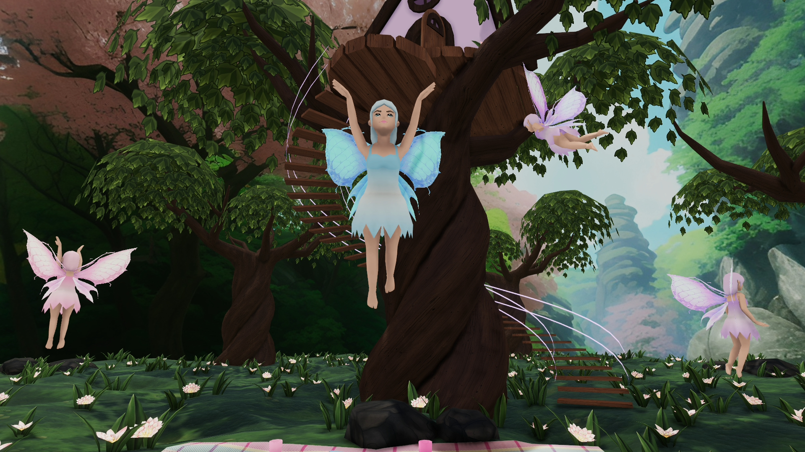
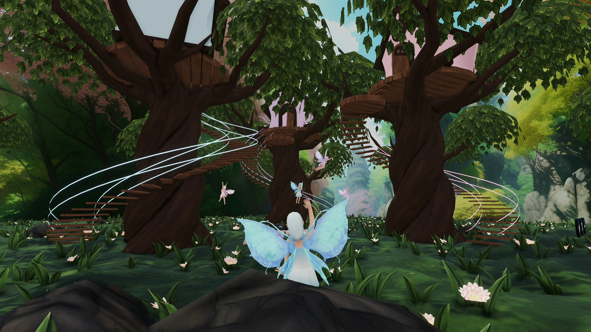
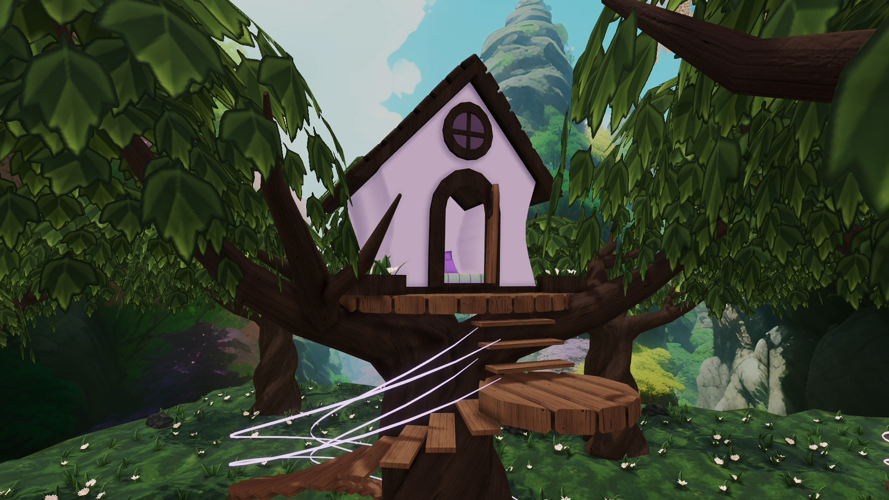

## 3D models

All of the 3D models have been created by me, with the exception of Github and Twitter link models around the scene, which are from Decentraland Builder.

Textures used for 3D models:

- For moss on the ground I used [ambientCG moss texture](https://ambientcg.com/view?id=Moss004) as a base and made changes to it using Midjourney. AmbientCG has a nice selection of textures under [Creative Commons CC0 1.0 Universal License](https://docs.ambientcg.com/books/website-licensing/page/license-information), but they are too realistic for Decentraland in my opinion. Find more details about how to use images as part of a prompt in their documentation [here](https://docs.midjourney.com/docs/image-prompts). From the generated images I ended up using the top left one.
  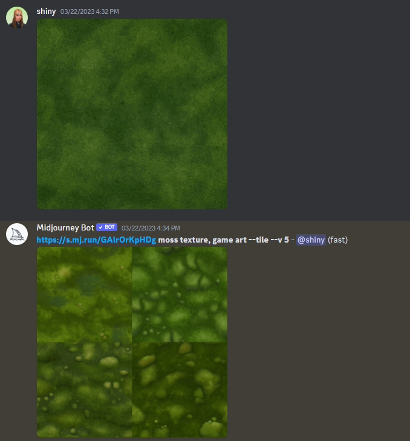

###

- For rocks on the ground I used the same approach as for the moss. Here are the rock textures generated using Midjourney with [ambientCG rock texture](https://ambientcg.com/view?id=Rock013) as part of the prompt. From generated images I used the top right image.
  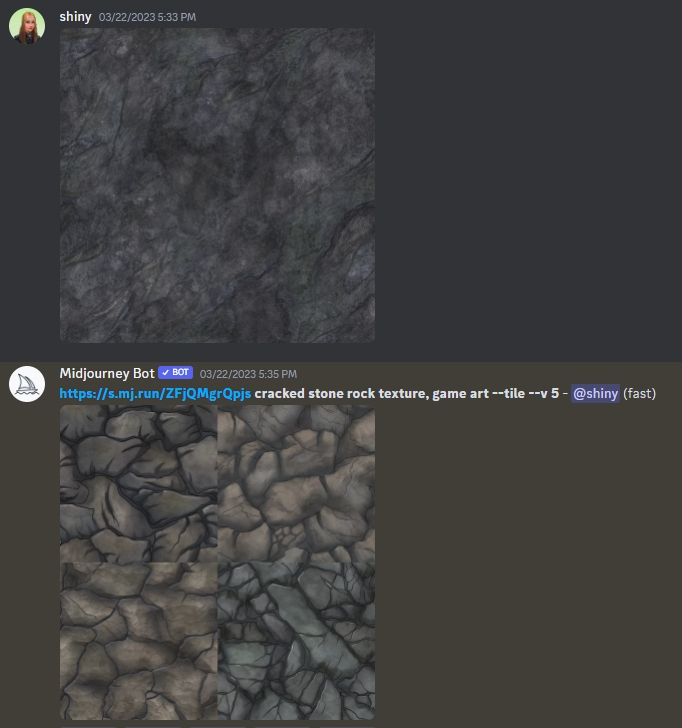

###

- Flowers, leaves on the ground, tree leaves, fairy wings and eyes were also generated using Midjourney. I removed the background from images and adjusted lightness, darkness and color. From the generated flowers I ended up using the top right one.
  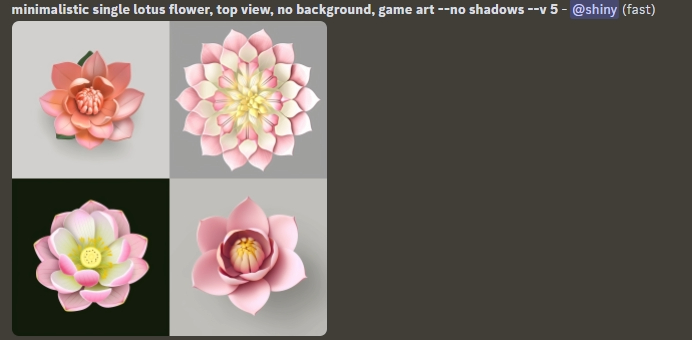

  And from these the bottom left one.
  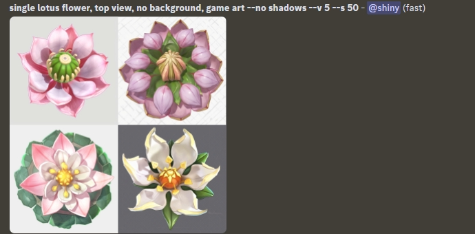

  For the leaves on the ground I used the top right image.
  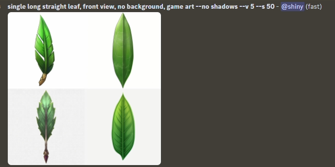

  For the tree leaves I used the top right image.
  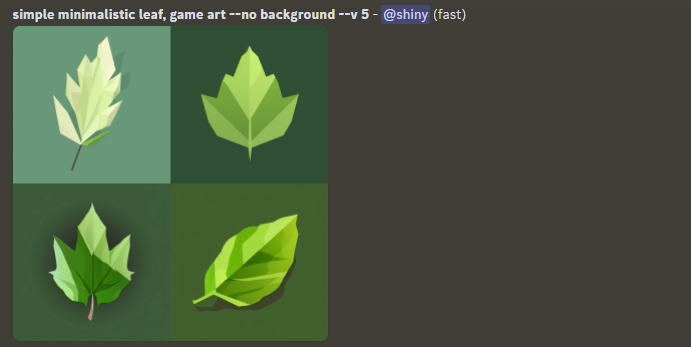

  As eyes for the fairies I used the top left image.
  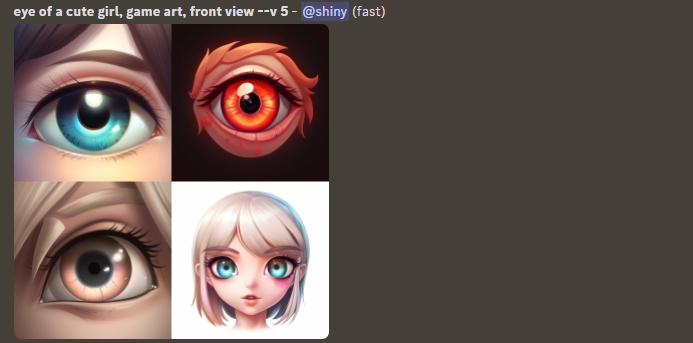

  And for fairy wings I used the bottom right image.
  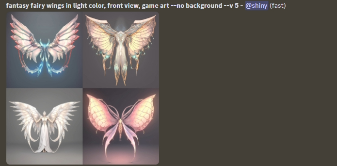

###

- The wood texture used for trees was generated using [Dream Textures](https://github.com/carson-katri/dream-textures). The advantage of using it over Midjourney is that it is free to generate images if you choose the installation with local rendering, although I have not been able to achieve results as good as with Midjourney.

###

- Texture for blanket from [ambientCG](https://ambientcg.com/view?id=Fabric058)

## Try it out

**Install the CLI**

Download and install the Decentraland CLI by running the following command:

```bash
npm i -g decentraland
```

**Previewing the scene**

Open this folder on the command line, then run:

```
npm run start
```

Any dependencies are installed and then the CLI opens the scene in a new browser tab.

## Copyright info

This scene is protected with a standard Apache 2 licence. See the terms and conditions in the [LICENSE](/LICENSE) file.
